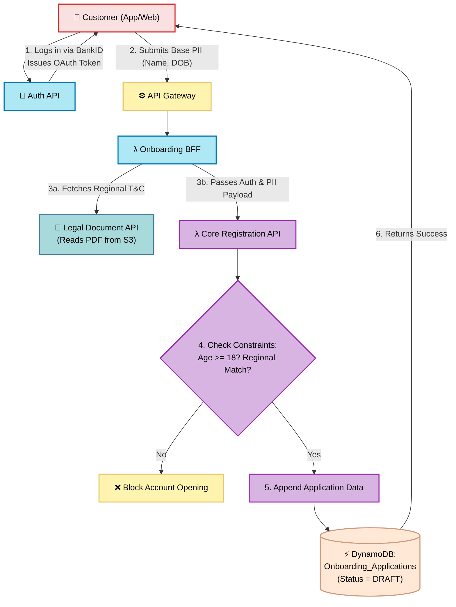

# Registration & Eligibility API

## What is it?
This is the "front door" for new customers. When a user opens the Alborz Bank app and sign up.

## Core Logic & Rules
1. **Age Check:** Customers must be 18 or older to open a savings account.
2. **Residency Check:** Customers must reside in a legally approved region (e.g., Sweden).
3. **Draft Saving:** Customers can drop off and resume their application days later.
4. **Legal Compliance:** Before letting the user submit the final application, this API fetches the exact, legally required Terms & Conditions PDF from the Legal Document API and forces the user to accept it.

## The BFF Pattern (Backend-For-Frontend)
The Onboarding BFF acts as the orchestration layer. The client makes a single HTTP POST request, the BFF fetches the legal docs, and then delegates the raw PII exclusively to the heavily secured internal Registration API.

## Data Flow Visualization

