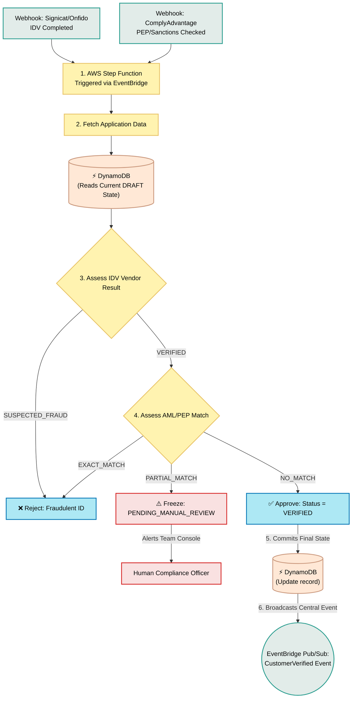

# Underwriting & Decision Engine

## What is it?
This is the automated "brain" of the bank's compliance team.

## Core Logic & Rules
1. **Wait for Evidence:** It pauses until all external checks (like the ID photo validation and the anti-money laundering watchlists) are completely finished.
2. **The "Green Light" Rule:** If the ID is perfectly `VERIFIED` AND the customer has `NO_MATCH` on external blacklists, the engine approves the application.
3. **The "Red Light" Rule:** If the ID is proven to be a fake or expired, it instantly rejects the applicant.
4. **The "Yellow Light" Rule:** If the person has the exact same name as a sanctioned politician, the engine freezes the application as `PENDING_MANUAL_REVIEW` and alerts a human compliance officer to take over.

## Detailed Execution Steps
The Step Function executes the following distinct stages in order:
1. **Trigger Phase:** Wakes up via EventBridge when the `All_KYC_Collected` event fires.
2. **Data Aggregation:** Queries DynamoDB to pull the user's PII, the exact IDV vendor results, and the AML screening payload.
3. **Hard Rules Check:** Instantly branches to `REJECTED` if Age < 18 or Residence is outside supported zones (redundancy check).
4. **Vendor Evaluation:** Asserts that the IDV Webhook explicitly returned `VERIFIED`. Any `SUSPECTED_FRAUD` instantly routes to rejection.
5. **Watchlist Evaluation:** Asserts that the ComplyAdvantage AML payload shows `NO_MATCH`. A partial PEP match routes to human review.
6. **Final State Commitment:** Writes the final boolean `APPROVED` or `REJECTED` state back to DynamoDB, locking the application.
7. **Downstream Notification:** Publishes the `CustomerVerified` event back to the global EventBus for other teams (like Team 2 Core Ledger) to react and physically open the bank account.

## Data Flow Visualization

