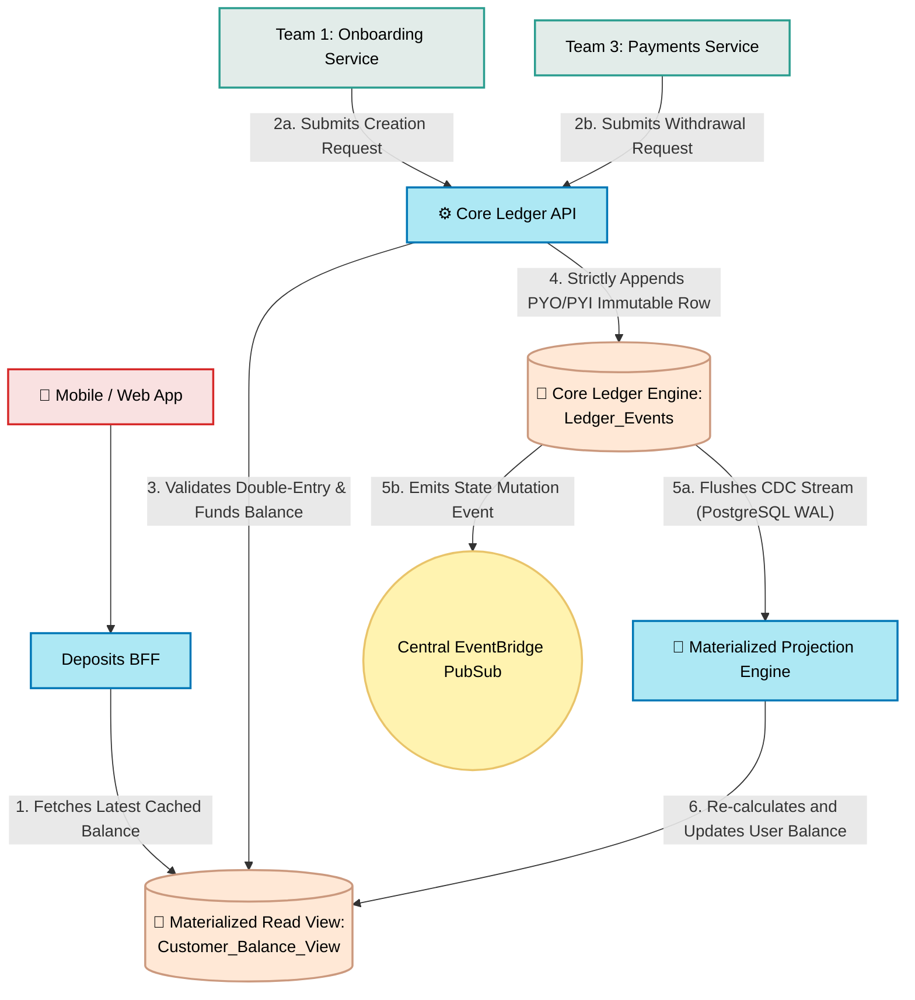

# Core Ledger Service

## What is it?
The absolute source of truth for all money in the bank. This synchronous API is entirely isolated from the internet. It exists to guarantee that no account can ever have a negative balance, and following other accounting rules. 

## Core Logic & Rules
1. **Strict Double-Entry:** Every mutation must have corresponding credits and debits that balance perfectly to zero. 
2. **Immutable Append-Only:** You cannot edit or delete a transaction. You can only append a new inverse transaction to correct a mistake.
3. **No External Access:** This service cannot be reached by the web or mobile app.

## Data Flow Visualization

