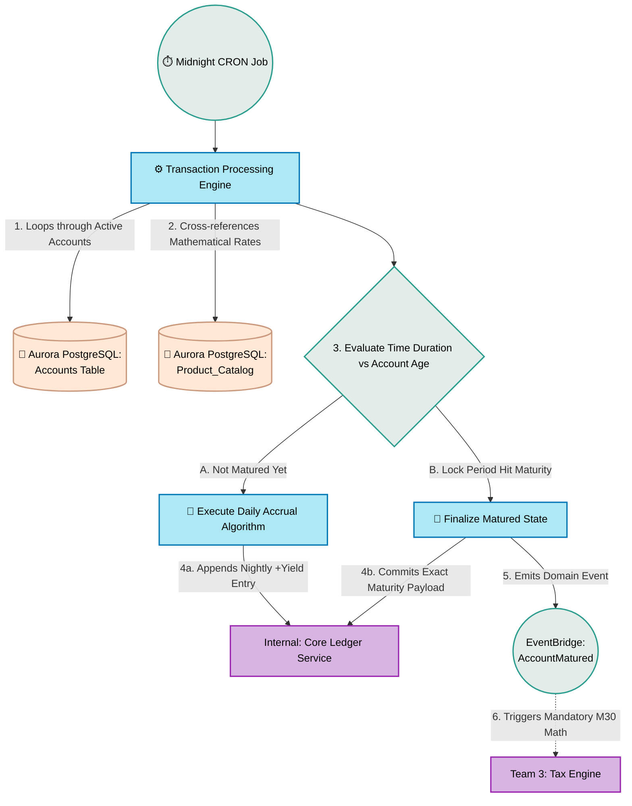

# Transaction Processing Service (Maturity & Interest)

## What is it?
It is responsible for calculating daily interest yield, understanding when fixed-term deposits mature, and automatically compounding interest.

## Core Logic & Rules
1. **Time-Driven Execution:** Relies on strict nightly CRON triggers to evaluate the state of every account.
2. **Yield Calculation:** Determines the exact fraction of interest owed to the customer based on the specific `Product_Catalog` rates assigned to their account at opening.
3. **Maturity Triggers:** When a fixed-term account naturally expires (e.g., a 1-year lock ends), this service publishes the critical `AccountMatured` domain event so the Payments team can physically move the fiat.

## Data Flow Visualization

