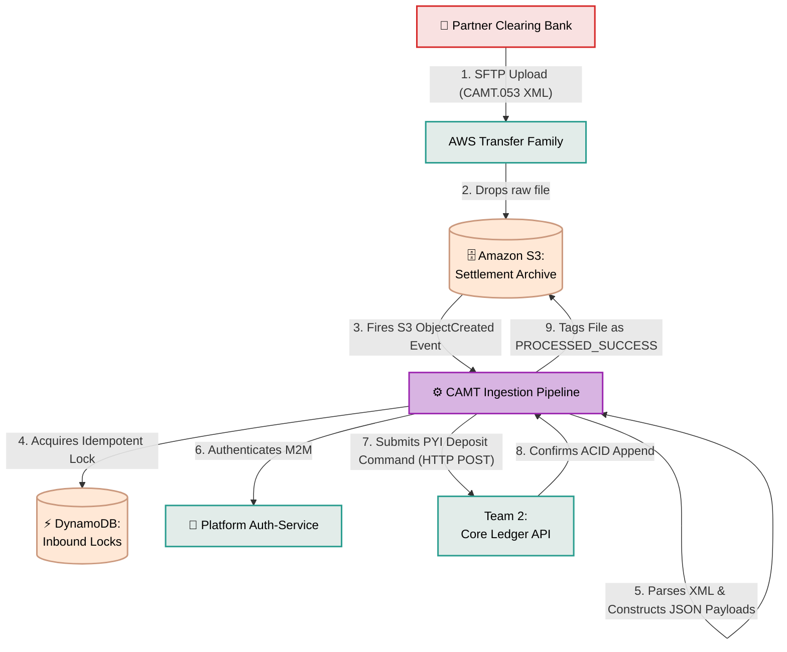

# CAMT Ingestion Pipeline

## What is it?
An automated, event-driven serverless pipeline responsible for securely receiving, parsing, and processing inbound fiat money transfers from external partner clearing banks. It reads strictly formatted ISO 20022 CAMT.053 XML files generated by the central bank and translates them into internal Core Ledger Deposit (PYI) commands.

## Core Logic & Rules
1. **Decoupled Ingestion:** The pipeline is purely reactive, triggered instantly by an AWS S3 `ObjectCreated` event when a partner bank drops an XML file via AWS Transfer Family (SFTP).
2. **Strict Idempotency:** Before parsing any file, the pipeline acquires a DynamoDB lock using the `MessageID` or `FileName` to ensure that a massive batch of incoming fiat payments is never accidentally processed twice.
3. **Delegated Execution:** The CAMT parser handles validating the XML schema and extracting the transaction details, but **does not** touch the PostgreSQL database directly. Instead, it delegates the mathematical money operations explicitly to Team 2's Core Ledger API via a synchronous, authenticated internal HTTP call.

## Data Flow Visualization

