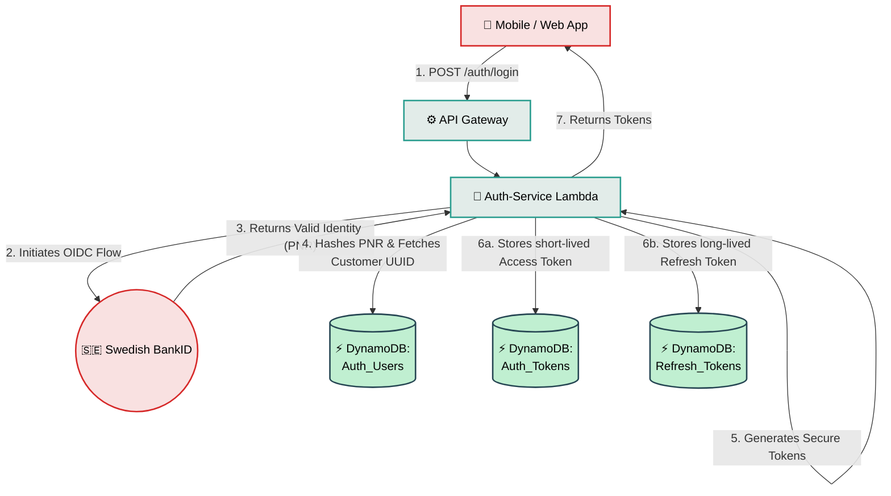

# Auth-Service

## What is it?
The central identity and access management (IAM) primitive for the entire Alborz Bank B2C architecture. It abstracts away complex federated identity protocols (like Swedish BankID OIDC) and provides a unified, secure Opaque Token issuance system. It guarantees that domain teams (like Deposits or Onboarding) never have to write custom authentication logic or securely hash passwords.

## Core Logic & Rules
1. **Centralized Authentication, Decentralized Authorization:** The Auth-Service proves *who* the user is, but the downstream microservices decide *what* that user is allowed to do.
2. **Stateless Edge, Stateful Core:** Access tokens are short-lived (15 minutes) and opaque. The API Gateway validates them statefully against DynamoDB on every request to ensure immediate global revocation capabilities (e.g., locking a stolen phone).
3. **Pii Minimization:** Core domain microservices use internal `customer_id` UUIDs. The Auth-Service handles the mapping from sensitive National IDs (PNR) to these internal agnostic IDs.

## Data Flow Visualization

