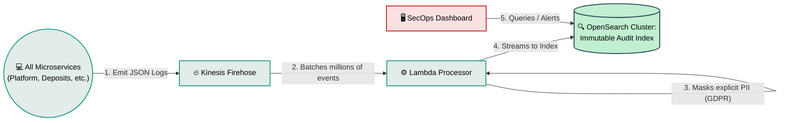

# Central Observability Pipeline

## What is it?
A completely decoupled, asynchronous data pipeline responsible for aggregating every single log, audit trail, and metric emitted by the bank's microservices. It provides the SecOps and Compliance teams with a centralized, searchable Google-like interface for diagnosing technical bugs or monitoring suspicious financial flows.

## Core Logic & Rules
1. **Zero-Blocking Architecture:** Writing a log must NEVER slow down a customer's financial transaction. All telemetry is ingested asynchronously via API Gateway or Firehose buffers.
2. **Automated PII Masking:** Before logs cross from the ingestion buffer into the permanent OpenSearch index, a transformation layer sweeps them, automatically hashing or masking explicit PII (like plain-text emails or unmasked IBANs) to comply with GDPR.
3. **Immutable Audit Trail:** Once telemetry hits the permanent index, it is structurally impossible for any developer or system to alter or delete history.

## Data Flow Visualization

