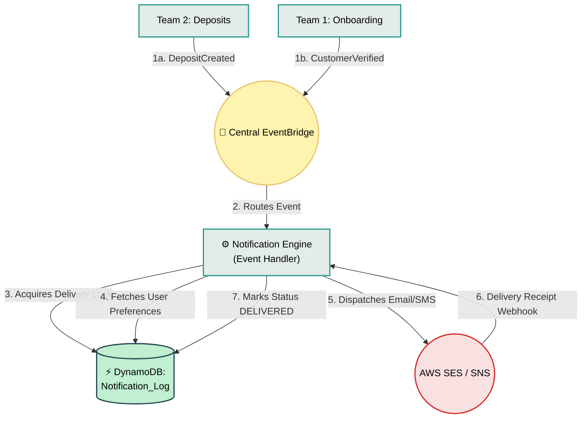

# Notification Engine

## What is it?
An asynchronous, event-driven service specializing in omni-channel customer communications. Instead of domain services (like Core Ledger) hardcoding email templates or managing SMTP servers, they simply publish standard Domain Events (like `DepositCreated`). The Notification Engine reacts to those events and handles the physical delivery of SMS, emails, or push notifications.

## Core Logic & Rules
1. **Event-Driven Choreography:** The entire engine runs in the background. It subscribes natively to the central AWS EventBridge bus, isolating communication failures from core banking processes.
2. **Strict Delivery Idempotency:** Users must absolutely never receive the same "Account Matured!" email twice. The engine utilizes DynamoDB to lock delivery and suppress any duplicate event payloads.
3. **Provider Agnostic:** It abstracts the downstream messaging providers (AWS SES, SNS, Twilio) away from the rest of the bank.

## Data Flow Visualization

