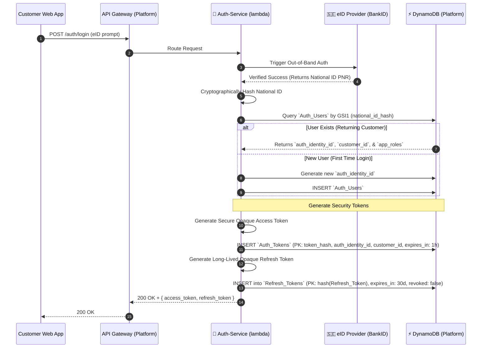
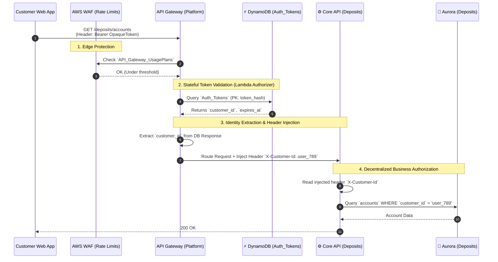
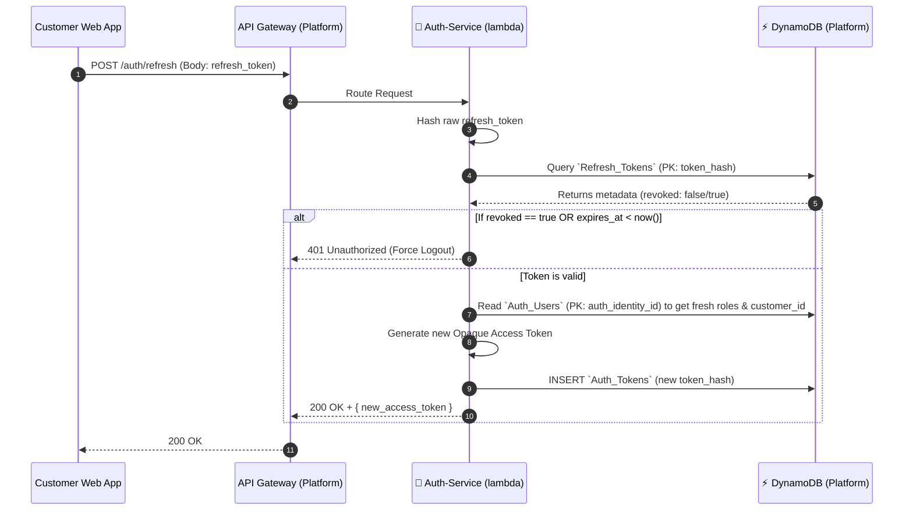

# Alborz Bank — Auth Service & Security Mapping

This document analyzes the authentication and authorization strategies across every boundary of the architecture. Since we must support both **Federated Identity** and **Local App Credentials** for B2C traffic, deploying a central Auth-Service backed by a credential store (DynamoDB) remains a strict architectural requirement.

---

## 0. Auth Types & Nomenclature

| Short Name | Type | Description |
|------------|------|-------------|
| **eID** | AuthN | Federated Identity Provider (Swedish BankID, Freja eID, etc.) handling external identity verification. |
| **Local-Cred** | AuthN | Internal Email/Password registration (stored securely in Platform's Auth-Service DynamoDB) + SMS OTP. |
| **SSO** | AuthN | Corporate Single Sign-On (Azure AD, Okta, Google Workspace) used strictly for employee back-office access. |
| **API-Key** | AuthN | Static secret keys configured in API Gateway/WAF + HMAC payload cryptographic signatures. |
| **SSH-Key** | AuthN | Secure Shell key pairs managed by AWS Transfer Family for SFTP. |
| **OAuth-Token** | AuthZ | Short-lived OAuth 2.0 Access Token. Grants limited scopes (e.g., `scope: draft_customer` or `scope: verified_customer`). |
| **OAuth-RBAC** | AuthZ | Strict Role-Based Access Control OAuth 2.0 Token. Must explicitly carry a role claim (e.g., `Role: Compliance_Officer`, `Role: Financial_Admin`). |
| **OAuth-M2M** | AuthZ | Machine-to-Machine OAuth Client Credentials token issued between internal microservices. |
| **AWS-IAM** | AuthZ | Native AWS IAM Execution Roles (AWS SigV4) & Resource Policies restricting access inside the VPC (Queues/EventBridge). |

---

## 1. External Facing (B2C - End Users)

| Owner Team | Actor | System / API Interaction | Requires Auth/Z | Proposed Solution |
|------------|-------|--------------------------|-----------------|-------------------|
| **Onboarding** | Unverified Customer | **Customer Registration Web App (UI)** | **AuthN:** Verify user intent to sign up/in. | **eID** OR **Local-Cred** |
| **Onboarding** | Unverified Customer | **Registration & Eligibility API** | **AuthZ:** Uploading ID, answering KYC. | **OAuth-Token** |
| **Deposits** | Verified Customer | **Customer Web App (Dashboard)** | **AuthN:** Verified users checking balances. | **eID** OR **Local-Cred** |
| **Deposits** | Verified Customer | **Core Ledger / Transactions API** | **AuthZ:** Viewing history, requesting withdrawals. | **OAuth-Token** |

---

## 2. Internal Facing (B2E - Employees & Staff)

| Owner Team | Actor | System / API Interaction | Requires Auth/Z | Proposed Solution |
|------------|-------|--------------------------|-----------------|-------------------|
| **Onboarding** | Compliance Officer | **Compliance Officer Dashboard (UI)** | **AuthN:** Log into back-office tools. | **SSO** |
| **Onboarding** | Compliance Officer | **Compliance & AML API** | **AuthZ:** Viewing PII, manually approving Underwriting cases. | **OAuth-RBAC** (`Compliance_Officer`) |
| **Onboarding** | Support Agent | **Customer Support CRM Tooling** | **AuthN:** Log into support hub. | **SSO** |
| **Onboarding** | Support Agent | **Support API** | **AuthZ:** Viewing masked funnel drop-offs. | **OAuth-RBAC** (`Support_Agent`) |
| **Deposits** | Financial Admin | **Interest Rate & Admin Portals** | **AuthZ:** Mutating rates, forcing transactions. | **OAuth-RBAC** (`Financial_Admin`) |

---

## 3. External Facing (B2B - Third Parties)

| Owner Team | Actor | System / API Interaction | Requires Auth/Z | Proposed Solution |
|------------|-------|--------------------------|-----------------|-------------------|
| **Onboarding** | Webhook Vendor (Onfido/Signicat) | **KYC & IDV Webhooks** | **AuthN / AuthZ:** Verifying the vendor sent it. | **API-Key** |
| **Payments** | Central Bank (SFTP Client) | **Partner Bank SFTP (CAMT Files)** | **AuthN:** Establishing tunnel. | **SSH-Key** |
| **Onboarding** | Open Banking Vendor (Plaid/Tink) | **Bank Validation** | **AuthZ:** Validating remote IBAN ownership. | **API-Key** (Client Credentials) |

---

## 4. System-to-System (M2M - Microservices)

| Owner Team | Actor | System / API Interaction | Requires Auth/Z | Proposed Solution |
|------------|-------|--------------------------|-----------------|-------------------|
| **Payments** | Internal Microservice | **Payments Engine → Deposits Ledger** | **AuthZ:** Payments committing `PYI` entries. | **OAuth-M2M** OR **AWS-IAM** |
| **Onboarding** | Internal Engine (Step Functions) | **Underwriting Engine → EventBridge** | **AuthZ:** Outputting final approval decisions. | **AWS-IAM** |
| **Platform** | CI/CD Pipeline (GitHub Actions) | **Platform CI/CD Pipelines** | **AuthZ:** Deploying code via Infrastructure as Code. | **AWS-IAM** (via OIDC credentials) |
| **Platform** | Cloud Event Bus (SQS/EventBridge) | **Async Queues** | **AuthZ:** Publishing and consuming events. | **AWS-IAM** |

---

## 5. Architectural Approach: Centralized Identity, Decentralized Authorization

To ensure maximum security, auditability, and independent microservice deployments, Alborz Bank dictates the **Centralized Authentication with Decentralized Business Authorization** hybrid model.

**Why this approach?**
1. **Security & Audit:** A single central identity provider ensures passwords are only hashed locally in one place, and external IDPs (like BankID) are only integrated once.
2. **Zero-Trust Boundaries:** Domain teams (Onboarding, Deposits) never have to implement custom authentication logic.
3. **Decoupled Business Logic:** The API Gateway ensures valid users reach the microservices, but each microservice decides if the user is authorized.
    - (e.g., checking if the `customerId` from the token actually owns the resource).

> **Note:** The actual BankID integration is a bit more complex than below, For sake of simplicity, I have omitted the details of the BankID integration.

### The Authentication & Authorization Flow

Below are the exact execution sequences mapping how the Platform team natively utilizes DynamoDB to manage stateless and stateful authentication.

#### 1. OAuth Token Generation (eID Login)
This sequence illustrates how Auth-Service works.

#### 2. Stateful API Authorization & Identity Extraction

#### 3. Token Refresh & Revocation (Stateful Verification)
Access tokens expire every 15 minutes. To get a new one, the client must use the Refresh Token. This is the only time the database is checked again, allowing the bank to instantly lock stolen devices.

