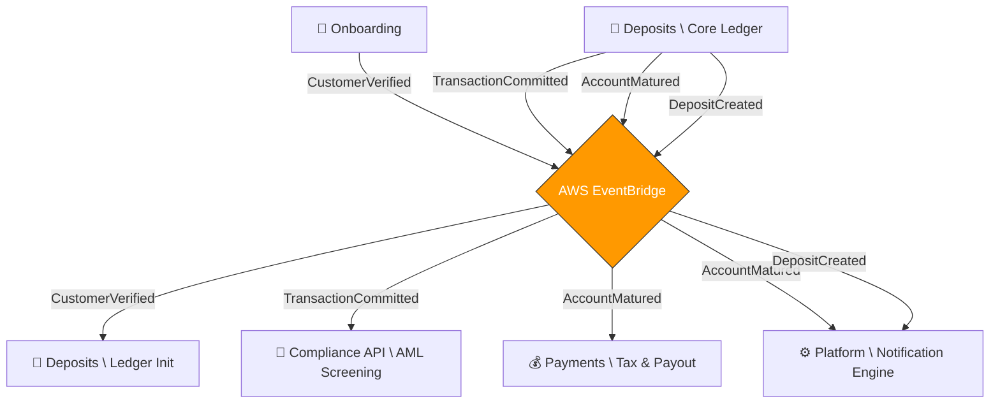
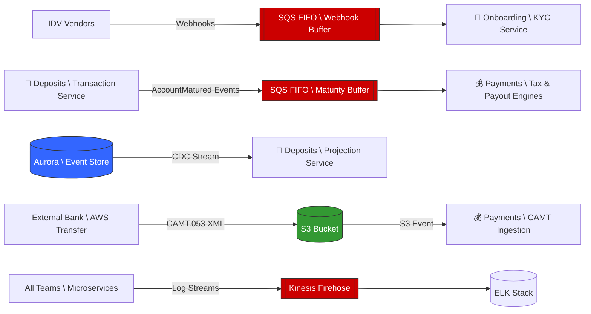
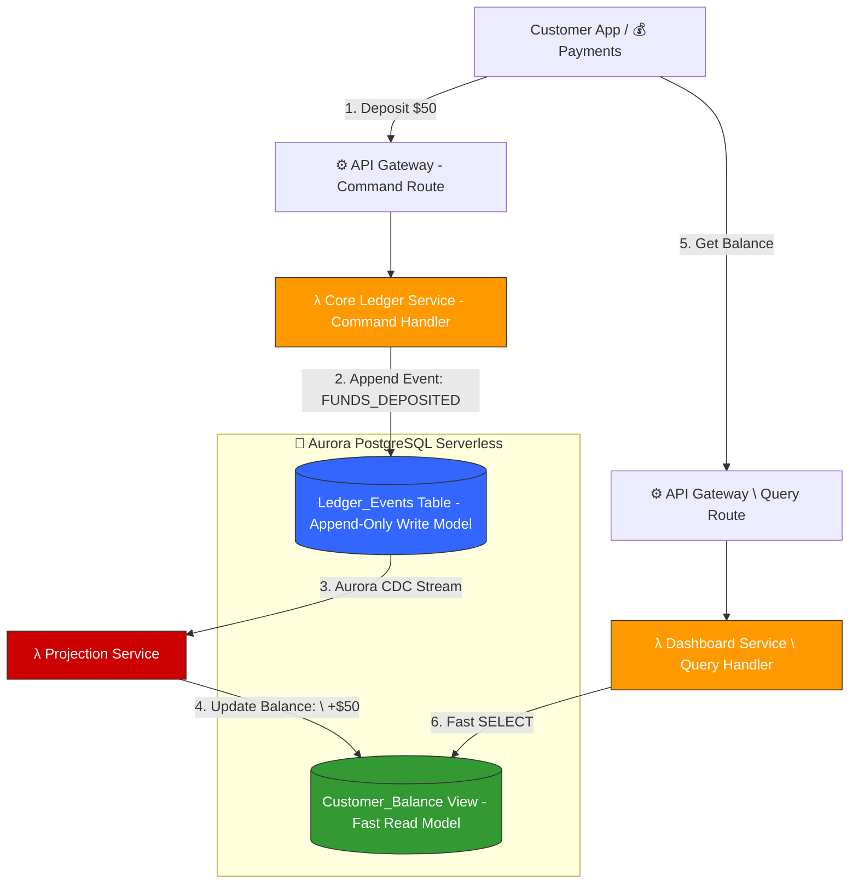

# Alborz Bank — Asynchronous & Messaging Strategy

This document catalogs and standardizes all asynchronous workflows, background jobs, publish/subscribe (PubSub) events, and message queues across all engineering teams.

## 1. Legend: Async Mechanisms

To ensure architectural consistency, we map all asynchronous interactions to a standardized set of AWS serverless primitives:

| Short Name | AWS Technology | Description / Justification |
| :--- | :--- | :--- |
| **`Cron-EB`** | EventBridge Scheduler | Highly scalable, timezone-aware scheduled triggers for nightly batch jobs. |
| **`Event-PubSub`** | EventBridge Custom Bus | Centralized event choreography. Producers fire-and-forget; multiple Consumers independently react. |
| **`Queue-FIFO`** | SQS (FIFO Queue) | Point-to-point queues guaranteeing exact ordering and strictly once-only processing (crucial for financial transactions). |
| **`Queue-Std`** | SQS (Standard Queue) | High-throughput, unordered work queues with built-in Dead Letter Queues (DLQ) for retryable independent tasks. |
| **`Stream-S3`** | S3 Event Notifications | Real-time triggers fired immediately when a file is created/modified in object storage. |
| **`Stream-Logs`** | Kinesis Firehose / CloudWatch | Asynchronous buffering and streaming of massive telemetry/log data. |

---

## 2. Scheduled Jobs (CRON Workloads)

Jobs that run on a strict programmatic schedule (e.g., daily at midnight).

| Job Name | Owning Team | Target Microservice | Trigger | Purpose / Detail |
| :--- | :--- | :--- | :--- | :--- |
| **Transaction Processing (Yield & Maturity)** | 🏦 Deposits | `Transaction Processing Service` | `Cron-EB` | Runs nightly to calculate accruals for accounts, and transitions expired fixed-term deposits to `MATURED`. |

---

## 3. Domain Event Choreography (Pub/Sub)

System-wide business events that trigger reactive logic across different bounded contexts without direct API coupling.

| Domain Event | Producer Team | Consumer Team / Service | Mechanism | Resulting Action |
| :--- | :--- | :--- | :--- | :--- |
| `CustomerVerified` | 🛂 Onboarding | 🏦 Deposits (`Core Ledger`) | `Event-PubSub` | Initializes a brand-new, empty savings account ledger for the newly approved customer. |
| `TransactionCommitted` | 🏦 Deposits | 🛂 Onboarding (`Compliance API`) | `Event-PubSub` | Real-time asynchronous AML screening. Flags suspicious transactions for manual compliance officer review without blocking live DB operations. |
| `AccountMatured` | 🏦 Deposits | 💰 Payments (`Tax Engine` / `Payout`) | `Event-PubSub` | Triggers the calculation of final withholding taxes and initiates the payout orbital workflow. |
| `AccountMatured` | 🏦 Deposits | ⚙️ Platform (`Notification Engine`) | `Event-PubSub` | Sends an email/SMS congratulating the user on maturity and detailing rollover options. |
| `DepositCreated` | 🏦 Deposits | ⚙️ Platform (`Notification Engine`) | `Event-PubSub` | Asynchronously triggers a transactional receipt email. |

---

## 4. Buffers and Point-to-Point Queues (SQS)

Used to decouple aggressive producers from fragile consumers, absorbing traffic spikes and implementing DLQ retry logic.

| Queue Name | Owning Team | Producer | Consumer | Mechanism | Purpose / Detail |
| :--- | :--- | :--- | :--- | :--- | :--- |
| **Maturity/Tax Orchestration Buffer** | 💰 Payments | 🏦 Deposits (`Transaction Processing Service`) | `Tax Engine / Payout` | `Queue-FIFO` | Absorbs end-of-month maturity spikes (e.g. Dec 31st), throttling the tax calculation concurrency. |
| **Payout Orchestration** | 💰 Payments | `Payout Orchestrator` | Central Bank APIs | `Queue-Std` | Batches outgoing money transfers, managing retries. |
| **Webhook Buffer** | 🛂 Onboarding | External IDV Vendors | `KYC Webhook Service` | `Queue-FIFO` | Guarantees ordered, zero-loss ingestion of verification webhooks from external IDV vendors. |

---

## 5. Streaming & Data Pipelines

| Pipeline Name | Owning Team | Trigger / Source | Destination | Mechanism | Purpose / Detail |
| :--- | :--- | :--- | :--- | :--- | :--- |
| **CAMT Ingestion** | 💰 Payments | External Banks via SFTP (AWS Transfer) | `CAMT Ingestion Pipeline` | `Stream-S3` | Wakes up a Lambda instantly when an XML file lands in the bucket to begin parsing. |
| **Central Observability** | ⚙️ Platform | All Microservices (CloudWatch) | ELK Stack | `Stream-Logs` | Streams audit and operational logs securely and asynchronously. |

---

## 6. Architecture Visualizations

### 6.1 Domain Event Choreography (`Event-PubSub`)

### 6.2 Data Pipelines, Queues, & Streams (`Queue-FIFO`, `Stream-S3`, `Stream-CDC`)

---

### 6.3 Event Sourcing:

**Event Sourcing combined with CQRS (Command Query Responsibility Segregation)**. 

Here is exactly how that pipeline works under the hood for the Deposits team:

### 1. The Write Model: `DB(Aurora \ Event Store)`
When the Payments team or a user initiates a transaction (like depositing $50), the `Core Ledger Service` does **not** find the user's current balance and update it. 

Instead, it uses **Event Sourcing**. It simply appends a brand new, immutable row to an `Events` table (e.g., `Event: FUNDS_DEPOSITED, Amount: $50, Timestamp...`). 
*   **Why?** In finance, you can never delete or magically overwrite history. If a mistake is made, you must append a compensating event (like a `CANCELLATION` or `REVERSAL`). The Event Store is the absolute, mathematically pure source of truth.

### 2. The Bridge: `CDC Stream` (Change Data Capture)
The moment that `$50` event is safely written to the Aurora database, a trigger goes off. AWS Aurora has native Change Data Capture (CDC) capabilities that immediately stream that new row out of the database as a raw event.

### 3. The Read Model: `ProjService[🏦 Deposits \ Projection Service]`
This Lambda function is the "Materializer" that bridges the gap between the Write Model and the Read Model.

This Lambda function catches that CDC stream event instantly. It looks at the event (`+$50`), finds the customer's cached Read-Model (which might currently say `$1,000`), and updates the Read-Model to say `$1,050`. 

*   **Mechanics (CDC)**: It doesn't poll; it is **event-driven**. It subscribes to Aurora's native **Logical Replication Slot** (using `pgoutput` or AWS Lambda Aurora triggers). Every `INSERT` to the `Ledger_Events` table fires this Lambda instantly.
*   **The Materialization Logic**: The Lambda parses the raw event payload (e.g., `DEPOSIT_COMPLETED`, `WITHDRAWAL_REQUESTED`). It performs a single-row "Upsert" to the `Customer_Balance` table, updating only the specific customer's current total.
*   **Idempotency & Sequence**: To prevent double-counting during Lambda retries, it verifies a `last_event_id` or `sequence_number` on the Read Model row before applying any mathematical changes.
*   **Self-Healing (Replayability)**: Because every transaction is stored as an immutable event, we can rebuild the entire `Customer_Balance` table from scratch at any time. If we ever discover a bug or change our balance-calculation logic, we simply delete the Read Model and "Replay" the entire event history through the Projection Service.

* **Why?** (This is the **CQRS** part). When a customer opens their mobile banking web app to view their dashboard, the app does *not* query the heavy Event Store or try to sum up 5 years of thousands of transactions. It just queries this lightning-fast Read-Model where the final balance is already pre-calculated! 

### Summary
By separating the **Write Model** (heavy, append-only, immutable) from the **Read Model** (fast, pre-calculated, highly queried), you guarantee mathematical perfection for the accountants while simultaneously guaranteeing blazing-fast mobile app load times for the customers.

