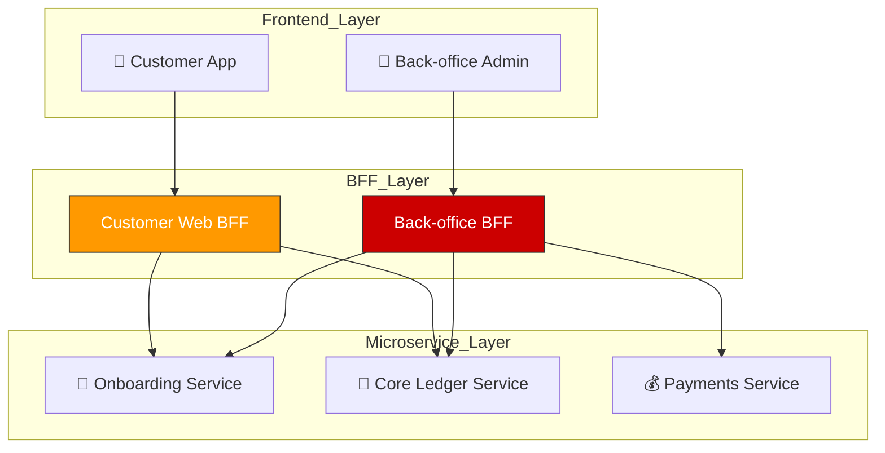

# Alborz Bank — BFF (Backend for Frontend) Strategy

The **Backend for Frontend (BFF)** pattern is used to provide a dedicated API layer for each frontend application. This simplifies data aggregation, optimizes network performance, and enforces UI-specific security rules.

## 1. Customer Web BFF
**Owner:** 🏦 Deposits Team

**Target UI:** Customer Web App (Dashboard, History, Rollover)

### Responsibilities:
- **Data Aggregation:** Consolidates the "Query" path (getting balances, transaction history, and active interest rates) into a single API response.
- **Onboarding Bridge:** Wraps the Onboarding Status API to show the user's eligibility and progress during the initial signup phase.
- **Protocol Translation:** Translates internal microservice api calls or synchronous REST calls into the optimized JSON formats.
- **Security:** Injects and validates the `customerId` header for data isolation.

---

## 2. Back-office Operations BFF
**Owner:** ⚙️ Platform Team (Shared / Infrastructure)

**Target UIs:** Compliance Dashboard, Admin Portal, Support CRM

### Responsibilities:
- **RBAC Enforcement:** Strictly enforces role-based access for bank employees.
- **Compliance Aggregation:** Combines PEP/Sanctions hits (Onboarding) with Transaction Histories (Deposits).
- **PII Redaction:** Automatically masks sensitive PII (Email, SSN).

---

## 3. Physical Architecture

---

## 4. Scaling Model

- **Standalone Serverless Units:** Each BFF is an independent **AWS Lambda** (or set of Lambda functions) behind its own **API Gateway** resource.

- **Independent Scaling:** The `Customer Web BFF` is scaled to handle public traffic, while the `Back-office BFF` is scaled for internal, low-concurrency usage.

- **Fault Isolation:** A crash or bottleneck in the internal Back-office BFF cannot impact the availability of the customer-facing mobile/web application.

- **Security Bounded Context:** The `Back-office BFF` exists inside a more restrictive network/WAF layer, as it has access to sensitive compliance and PEP data.

