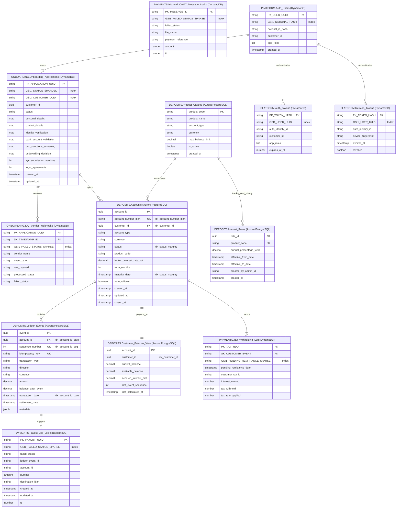
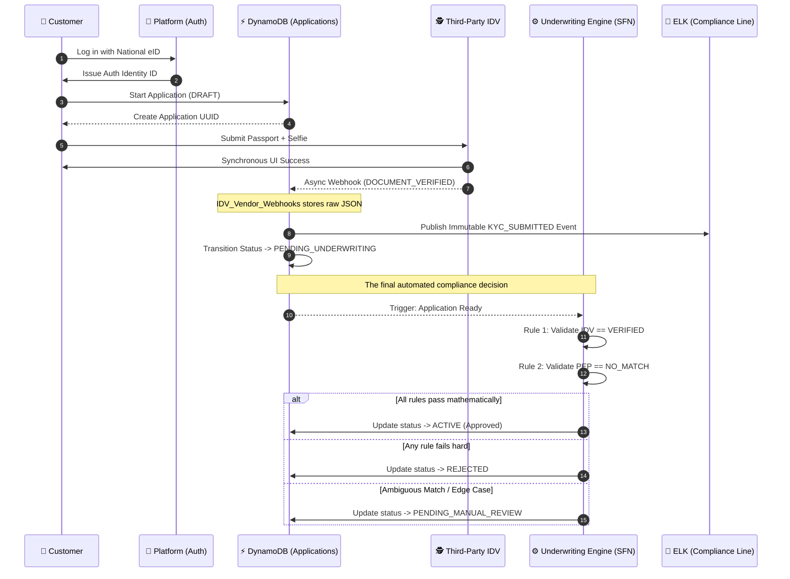
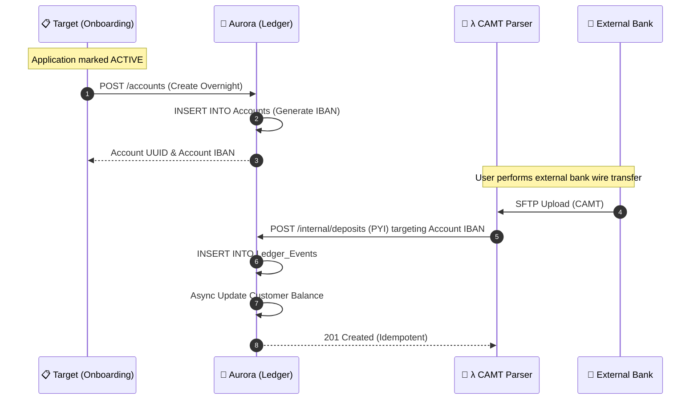
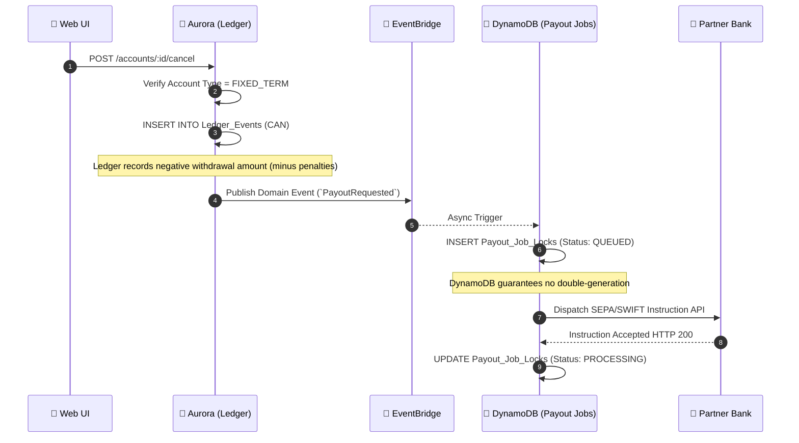
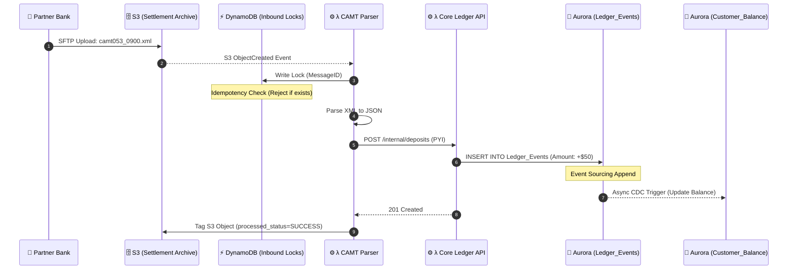
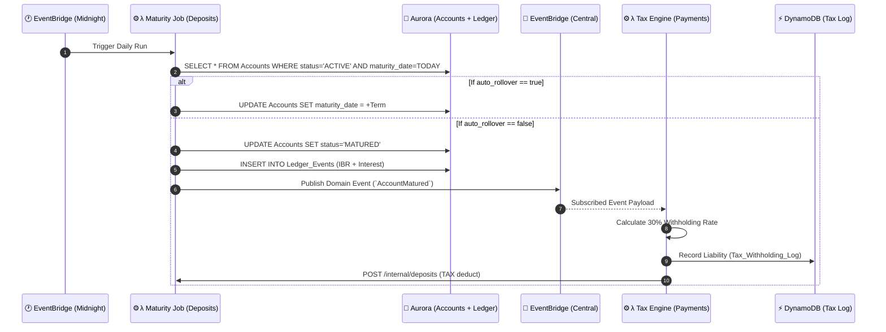

# Alborz Bank — Database Models & Flows

This document visualizes the exact database schemas for the four engineering teams and maps out how data flows through them during key banking scenarios.

## 1. Unified Database Schema (ERD)

---

## 2. Scenario Data Flows

### Flow A: Sign Up & Identity Verification (Onboarding & Underwriting)
This sequence illustrates the state machine a new customer passes through to clear bank compliance constraints and receive final underwriting approval.

---

### Flow B: Account Creation & Initial Deposit (Onboarding -> Deposits -> Payments)
This captures the moment the application is approved, the bank account is physically provisioned in the ledger, and the user sends in their very first wire transfer.

---

### Flow C: Early Term Cancellation & Withdrawal (Deposits -> Payments)
This flow tracks the complex distributed transaction of breaking a time-locked deposit and returning the money to the user.

---

### Flow D: Inbound Payment (CAMT Import to Core Ledger)
This sequence maps how the Payments team converts raw external XML into a strictly ACID-compliant PostgreSQL ledger.

---

### Flow E: Midnight Account Maturity (Fixed-Term Rollover)
This sequence maps the scheduled domain logic for migrating money states.

