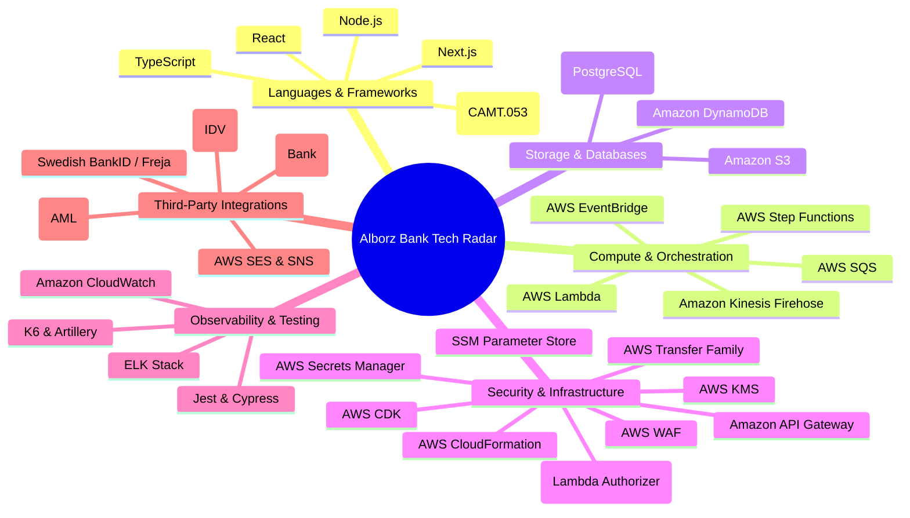

# Alborz Bank — Tech Radar & Architecture Map

This document provides a comprehensive view of the technologies, frameworks, and third-party integrations used to build the Alborz Bank Savings Account platform. It serves as a visual and tabular mapping of which tools are owned by which teams and for what purpose.

---

## Visual Tech Radar

The following mind map visualizes the core pillars of our technology stack:

---

## Tool to Team & Service Mapping

This table connects every technology constraint from the project roadmap to the specific feature teams and the architectural services they support.

### 1. Languages & Frameworks

| Technology | Owning Team(s) | Primary Services & Use Cases |
|------------|----------------|------------------------------|
| **Node.js** | All Teams | Default backend runtime for all serverless microservices and AWS Lambda functions. |
| **TypeScript** | All Teams | Static typing across the entire monorepo (frontend, backend, and CDK infrastructure). |
| **React** | Onboarding, Deposits | Frontend library used for the Customer Web App, Compliance Dashboard, and Admin Portal. |
| **Next.js** | Deposits | Server-side rendering and routing for the Customer Web App. |
| **XML Parsing** | Payments | Used strictly for parsing incoming ISO 20022 CAMT.053 settlement files from the Central Bank. |

### 2. Compute, Storage, & Data

| Technology | Owning Team(s) | Primary Services & Use Cases |
|------------|----------------|------------------------------|
| **AWS Lambda** | All Teams | Serverless execution for API endpoints, webhook consumers, and event-driven functions. |
| **Amazon DynamoDB** | Onboarding, Payments, Platform | NoSQL storage for onboarding states, payment idempotency locks, and massive-scale stateful token storage (`Auth_Users` / `Auth_Tokens`). |
| **Amazon Aurora (PostgreSQL)** | Deposits | Relational persistence for strictly ACID-compliant financial ledgers and transaction tables. |
| **Amazon S3** | Payments, Onboarding | Immutable storage for incoming CAMT settlement files, outgoing regulatory reports (Payments), and versioned Legal PDFs (Onboarding). |

### 3. Messaging & Orchestration

| Technology | Owning Team(s) | Primary Services & Use Cases |
|------------|----------------|------------------------------|
| **AWS EventBridge** | All Teams | Central event bus for cross-domain choreography (e.g., `CustomerVerified`, `PaymentFailed`). Also used for CRON scheduling of EOM tax jobs. |
| **AWS SQS & DLQ** | Payments, Onboarding | Asynchronous task queues for payout jobs and Dead Letter Queues for incoming vendor IDV webhooks. |
| **AWS Step Functions** | Payments, Onboarding | State machine orchestration for payout batches (Payments) and dynamic KYC/PEP underwriting evaluation (Onboarding). |
| **Amazon Kinesis Firehose** | Platform | Resilient buffering and routing of massive application logs into OpenSearch without overwhelming the cluster. |

### 4. Infrastructure & Security

| Technology | Owning Team(s) | Primary Services & Use Cases |
|------------|----------------|------------------------------|
| **AWS CDK / CloudFormation** | Platform | TypeScript-based Infrastructure as Code (IaC) defining the AWS environments for all teams. |
| **Auth-Service** | Platform | Centralized authentication Lambda issuing stateful opaque tokens for API access. |
| **Amazon API Gateway** | Platform | Primary ingress gateway. Triggers Lambda Authorizer to validate tokens and injects `X-Customer-Id` headers. |
| **AWS KMS & Secrets Manager** | Platform | Encryption of PII data at rest and secure vault for third-party API keys and database credentials. |
| **AWS WAF** | Platform | Web Application Firewall deployed at the API Gateway edge for DDoS protection and rate limiting. |
| **AWS Systems Manager (SSM)** | Platform | Centralized parameter store for configurations, runbooks, and operational controls. |
| **AWS Transfer Family** | Payments | Managed SFTP endpoints for secure file transmission to and from partner banks. |

### 5. Observability & Testing

| Technology | Owning Team(s) | Primary Services & Use Cases |
|------------|----------------|------------------------------|
| **Amazon CloudWatch** | All Teams | Centralized basic metrics, alarms, and CloudTrail auditing. |
| **ELK Stack** | Platform | Advanced log aggregation, PII-redacted structured logging searches across all microservices. |
| **Jest & Cypress** | Onboarding, Deposits | Automated Unit and End-to-End (E2E) UI testing frameworks integrated into CI/CD. |
| **K6 / Artillery** | Platform | Distributed load testing executed centrally to validate throughput during Phase 3 hardening. |

### 6. External SaaS & Integrations

| Technology | Owning Team(s) | Primary Services & Use Cases |
|------------|----------------|------------------------------|
| **Swedish BankID / Freja** | Onboarding | National eID providers used for secure, federated customer login and identity proving. |
| **Onfido / Signicat** | Onboarding | Identity Verification (IDV) via webhooks (e.g., liveness checks, document validation). |
| **ComplyAdvantage** | Onboarding | Watchlist screening (PEP, Sanctions, adverse media) integrated into the registration flow. |
| **Plaid / Tink** | Onboarding | Account ownership validation (Open Banking) to ensure IBANs belong to the registered user. |
| **AWS SES & SNS** | Platform | Centralized Notification Engine for transactional customer communications (Emails under SES, SMS via SNS). |
| **Mixpanel / GA** | Onboarding | Product and funnel analytics to track application drop-off rates during soft launch. |
