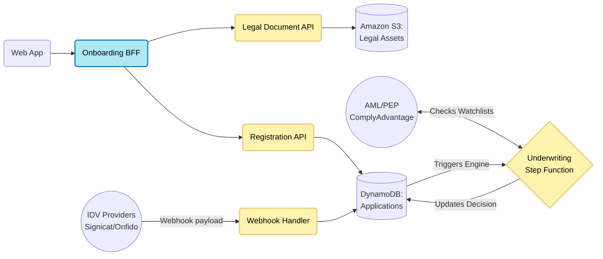
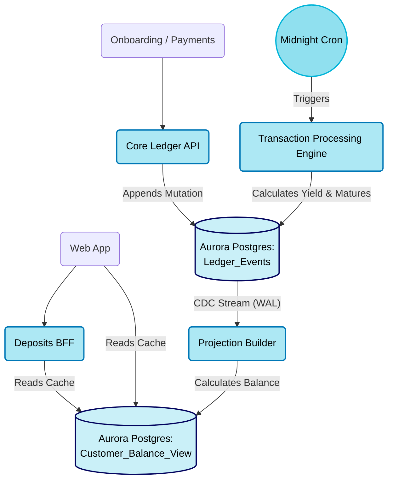
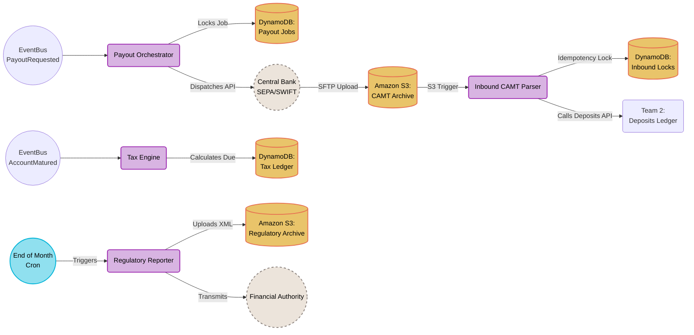
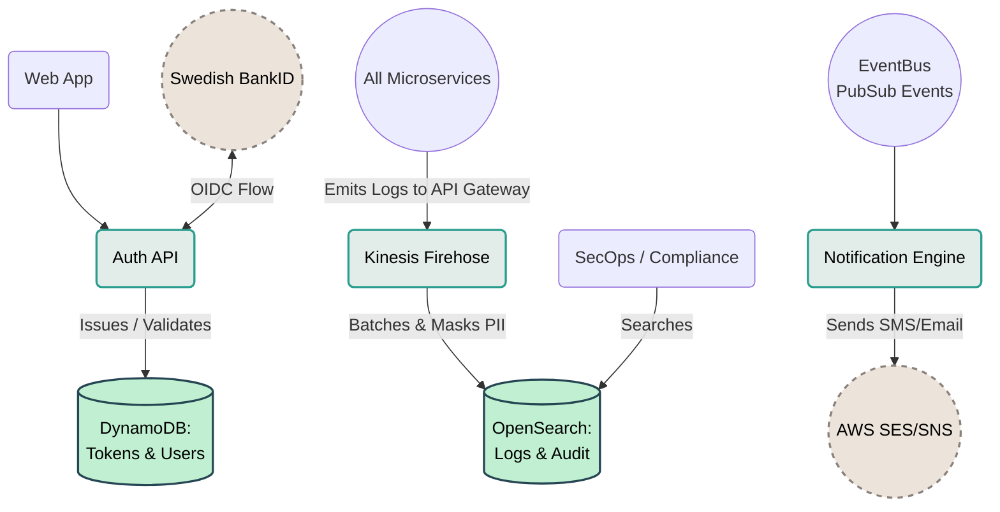

# Alborz Bank — High-Level System Architecture of All Teams

---

## Team 1: Onboarding & Compliance

---

## Team 2: Deposits & Transactions

---

## Team 3: Payments & Accounting

---

## Team 4: Platform & Shared

---
