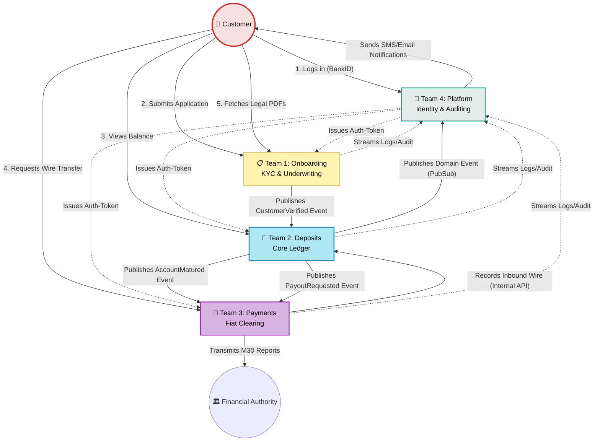
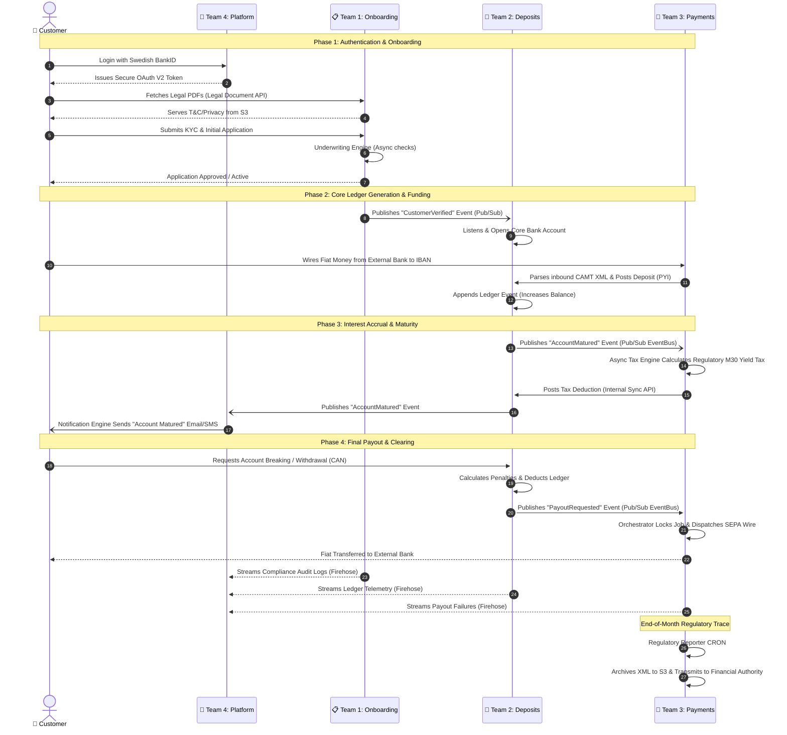

# Alborz Bank — High-Level System Architecture

## The Alborz Universe: Cross-Team Communication
This diagram maps how the Customer interacts with the diverse engineering teams, and how those team s communicate with each other securely in the backend.

## The Alborz Universe: End-to-End Data Flow
This sequence diagram illustrates a complete, high-level end-to-end customer journey bridging all 5 distinct worlds (The Customer and the 4 Engineering Teams) to visualize exactly how the microservices interlock to deliver the banking experience.

