# Alborz Bank — Team & Service Interactions

This document visualizes how the different feature teams, their respective services, internal databases, and external third-party systems interact at a high level.

## High-Level System Architecture map

The following Mermaid diagram tracks component ownership by grouping services within their respective teams (`Platform`, `Onboarding`, `Deposits`, `Payments`). 

It deliberately avoids deep implementation details and focuses strictly on **boundaries, API interactions, and data flow**.

```mermaid
flowchart TD
    %% --------------------------------
    %% 1. EXTERNAL ACTORS
    %% --------------------------------
    subgraph External["🌍 External Actors & Systems"]
        User(["👤 End Customer / User"])
        IDV["🛡️ Onfido / IDnow (IDV)"]
        AML["⚖️ ComplyAdvantage (AML)"]
        OpenBanking["🏦 Plaid / Tink (IBAN Check)"]
        PartnerBank["🏦 Partner Bank (SFTP)"]
    end

    %% --------------------------------
    %% 2. PLATFORM TEAM
    %% --------------------------------
    subgraph Platform["🛠️ Platform Team"]
        APIGW{"AWS API Gateway & WAF"}
        Auth["Auth-Service"]
        EventBus{{"AWS EventBridge\n(Central Event Bus)"}}
        AuthDB[("DynamoDB\n(User Credentials)")]
    end

    %% --------------------------------
    %% 3. ONBOARDING TEAM
    %% --------------------------------
    subgraph Onboarding["🚀 Onboarding Team"]
        OnboardingAPI["Registration & KYC API"]
        ComplianceUI["Compliance Officer Dashboard"]
        UnderwritingEngine["Underwriting Engine (Step Functions)"]
        OnboardDB[("DynamoDB\n(Customer State)")]
    end

    %% --------------------------------
    %% 4. DEPOSITS TEAM
    %% --------------------------------
    subgraph Deposits["💰 Deposits Team"]
        WebApp["Customer Web App (React)"]
        DepositAPI["Core Ledger & Transaction API"]
        Notification["Notification Service (SES/SNS)"]
        LedgerDB[("Aurora PostgreSQL\n(Core Financial Ledger)")]
    end

    %% --------------------------------
    %% 5. PAYMENTS TEAM
    %% --------------------------------
    subgraph Payments["🔄 Payments Team"]
        CAMTProcessor["CAMT.053 Parser API"]
        PayoutEngine["Interest & Tax Payout Engine"]
        S3Bucket[("Amazon S3\n(CAMT XML Archive)")]
        PaymentDB[("DynamoDB\n(Idempotency Locks)")]
    end

    %% ==========================================
    %% ------------------------------------------
    %% INTERACTIONS (Internal & Cross-Team)
    %% ------------------------------------------
    %% ==========================================

    %% User & Gateway Flow
    User -->|Access Frontend| WebApp
    User -->|HTTP API Requests| APIGW
    APIGW <-->|Validate/Issue Tokens| Auth
    Auth <-->|Read/Write Credentials| AuthDB

    %% Gateway to Feature Teams (Internal Edge)
    APIGW -->|Route Onboarding Reqs| OnboardingAPI
    APIGW -->|Route Deposit Reqs| DepositAPI

    %% Onboarding Internals
    OnboardingAPI <-->|Save KYC Answers| OnboardDB
    ComplianceUI -->|Read/Approve PEPs| OnboardDB
    OnboardDB -->|Trigger Evaluation| UnderwritingEngine
    UnderwritingEngine -->|Write Decision| OnboardDB

    %% Onboarding External Interacts
    OnboardingAPI <-->|Webhook/API Sync| IDV
    OnboardingAPI -->|Check AML/Sanctions| AML
    OnboardingAPI -->|Verify Bank Ownership| OpenBanking

    %% Deposits Internals
    WebApp -->|Fetch Balances| APIGW
    DepositAPI <-->|ACID Transactions| LedgerDB
    DepositAPI -->|Trigger Emails/SMS| Notification

    %% Payments Internals & Externals
    PartnerBank -->|Upload CAMT.053| CAMTProcessor
    CAMTProcessor -->|Archive XML Files| S3Bucket
    PayoutEngine <-->|Acquire Job Locks| PaymentDB

    %% Cross-Team Operations (The Event Bus + Direct API Calls)
    OnboardingAPI -->|Publish 'CustomerVerified'| EventBus
    EventBus -.->|Trigger Customer Setup| DepositAPI

    DepositAPI -->|Publish 'DepositCreated'| EventBus
    EventBus -.->|Trigger Interest Engine| PayoutEngine

    CAMTProcessor -->|Request 'PYI' Transaction| APIGW
    PayoutEngine -->|Request 'PYO/CAN' Transaction| APIGW
```

---

## Interaction Types Explained

Based on the diagram above, here is a quick textual breakdown of how systems interact within Alborz Bank.

### 1. External Integrations
* **Webhooks & APIs:** The Onboarding Team makes heavy use of REST APIs and Webhooks to communicate with third-party vendors (Onfido, ComplyAdvantage, Plaid) to verify user legitimacy.
* **Batch Files (SFTP):** The Payments team bypasses standard APIs to ingest large settlement XML files (CAMT.053) securely over SFTP from the Central/Partner Bank.

### 2. Internal Cross-Team Interactions
* **Synchronous (Direct API Calls):** When the CAMT Parser (Payments Team) matches an incoming deposit to an account, it makes a direct, synchronous HTTP call back to the `DepositAPI` (via the Platform's API Gateway) to instantly credit the user's ledger with a `PYI` (Pay-In) transaction.
* **Asynchronous (EventBridge):** To prevent tight coupling, non-critical background processes operate via pub/sub events. For example, when the `OnboardingAPI` verifies a customer, it dumps a `CustomerVerified` event onto EventBridge. The `DepositAPI` listens to this event async to initialize the customer's empty ledger account in the background.

### 3. Team to Data Isolation
* As demonstrated, **no team directly queries another team's database**. 
* The `Onboarding Team` does not perform SQL queries on the `Aurora PostgreSQL` database. If they need ledger data, they request it via the `Deposits` team's API constraints. This strict data isolation prevents systemic outages during schema changes.
