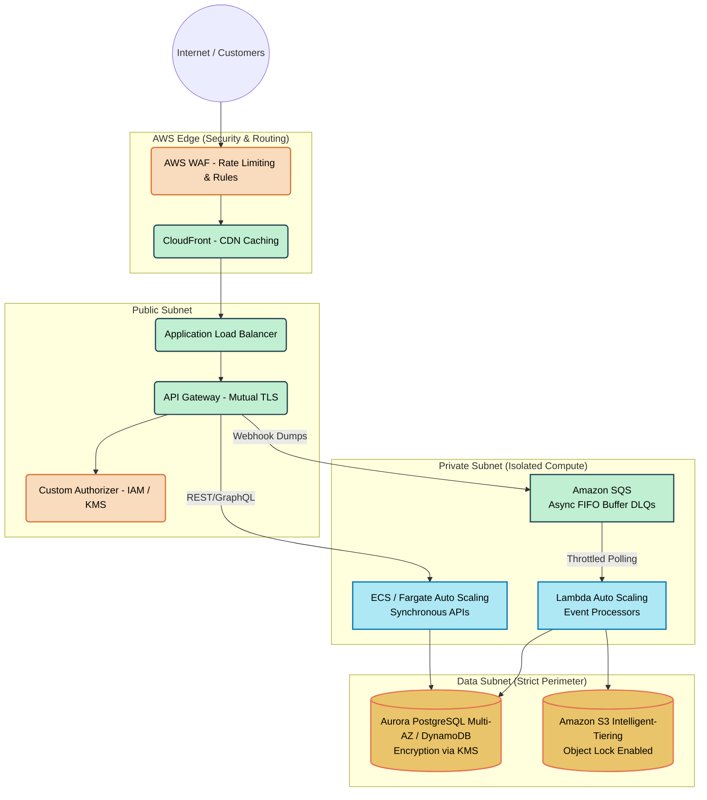
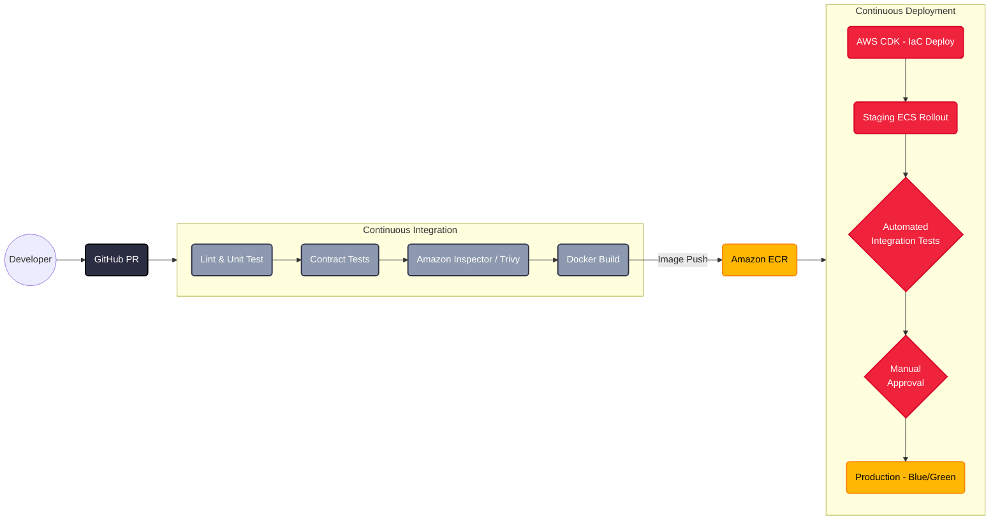
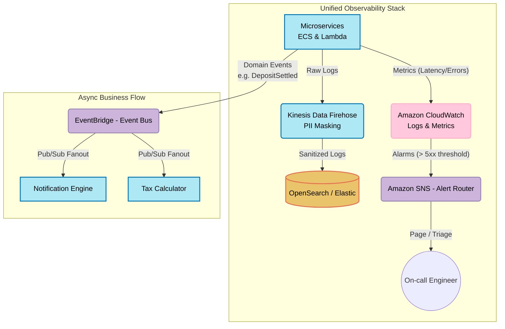

# DevOps & AWS Infrastructure Architecture

This document maps out how the DevOps tools and AWS managed services support the Alborz Bank ecosystem, strictly aligned with the **AWS Well-Architected Framework**.

---

## 🏗️ 1. Network & Traffic Flow (Core Infrastructure)

### Well-Architected Pillars Covered Here
* **Security:** Strict network segmentation (VPCs), DDoS protection (WAF), and at-rest encryption (KMS).
* **Reliability:** High availability via Multi-AZ deployments and compute protection using SQS FIFO buffers.
* **Performance Efficiency:** Serverless auto-scaling (Fargate/Lambda) and global asset caching (CloudFront).

---

## ⚙️ 2. CI/CD Pipeline Flow (Deployment & Quality)

### Well-Architected Pillars Covered Here
* **Operational Excellence:** Infrastructure as Code (CDK) with automated Blue/Green rollbacks for safe deployments.
* **Security:** Automated Trivy/Inspector container scanning blocks vulnerabilities before production.
* **Reliability:** Pre-deployment contract tests guarantee safe inter-service communication.

---

## 🔭 3. Observability & Async Messaging (Operations)

### Well-Architected Pillars Covered Here
* **Operational Excellence:** Centralized CloudWatch alarms and SNS routing enable proactive incident response.
* **Security:** Kinesis Data Firehose actively masks plaintext PII before it reaches searchable log indices.
* **Cost Optimization & Sustainability:** Event-driven pub/sub removes polling waste, reducing carbon footprint and baseline costs.
